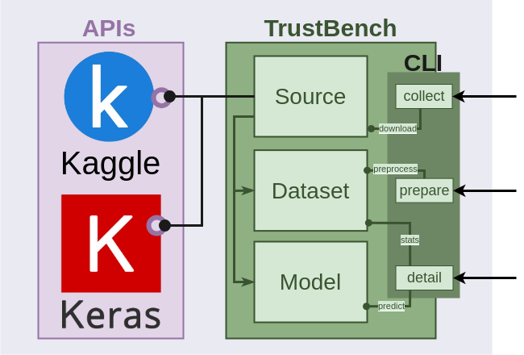

# TrustBench
A Benchmark for Trustworthiness Evaluation of Machine Learning Models 

## Description



TrustBench facilitates creation of benchmarks in a standard manner, that can be easily used by the community to conduct 
future studies on DNN models. This involves collection and preparation of datasets and models from different domains. 
TrustBench interacts with the APIs of two data sources, Kaggle and Keras. TrustBench works with JSON configurations; 
new datasets can seamlessly be added to the benchmark by just writing a file. 

## Installation
TrustBench is implemented in Python 3.10. To install the required packages, run:

```shell
#Optional: Create a virtual environment
$ python3.10 -m venv env
$ source env/bin/activate
$ pip install .
$ export TRUSTBENCH_PATH=~/.trustbench
$ mkdir $TRUSTBENCH_PATH
$ cp -r config $TRUSTBENCH_PATH
```

## Configuration

Kaggle requires an API configuration to use. 
1. Create the Kaggle API key under your profile Settings. 
2. Save the `kaggle.json` file under the `.kaggle` folder in your home directory.
   1. Linux - `~/.kaggle/kaggle.json`;
   2. Windows - `C:\Users\<Windows-username>\.kaggle\kaggle.json`.

## Usage

### Collect Data and Models
To collect datasets and/or models from specified sources using TrustBench, use the following command:

```bash
$ python trustbench.py collect -s [source] [-d] [-m]
```
- -s, --source: Specify the data source from which to collect, choose from Kaggle or Keras.
- -d, --datasets: Optional flag to collect datasets.
- -m, --models: Optional flag to collect models.

### Prepare Datasets

To prepare a dataset for benchmarking, use the following command:

```bash
$ python trustbench.py prepare -d [dataset] [-rs]
```
- -d, --dataset: Specify the dataset to prepare.
- -rs, --random_state: Optional parameter to set a random state for reproducibility.

### Display Dataset and Model Details
To display details about a specific dataset and its associated models, use the following command:

```bash
$ python trustbench.py detail -d [dataset] [-m]
```

- -d, --dataset: Specify the dataset to display details for.
- -m, --model: Optional parameter to specify a particular model for the dataset.

### Write a Configuration File

To create a configuration for a dataset in TrustBench, follow these steps:

1. Create a JSON file in the `config/datasets` directory.
2. Define Dataset Information: Determine the dataset's name and its configuration details.
3. Specify Collection Source and Parameters: Decide from where and how the dataset will be collected. In the configuration, specify the collection source (e.g., Kaggle) and any necessary parameters (e.g., owner and dataset name).
4. Preprocessing Instructions: Define how the dataset will be preprocessed before use. This includes specifying options such as labeling columns, splitting data for training, scaling, binarizing categorical variables, factorizing, dropping unnecessary columns, etc.
5. Data Format: Determine the format of the dataset, whether it's in CSV or NPY format. This defines how the dataset is loaded and preprocessed.

To create a configuration for a model in TrustBench, follow these steps:

1. Create a JSON file in the `config/models` directory.
2. Define Model Information: Determine the model's name and its configuration details.
3. Specify Collection Source and Parameters: Decide from where and how the model will be collected (this needs to be implemented by the respective source). In the configuration, specify the collection source (e.g., Kaggle) and any necessary parameters (e.g., owner, model name, framework, instance, version, and file name).
4. Associate with Dataset: Associate the model with a dataset by specifying the dataset name.

For examples of configuration files, refer to the `config` directory.

With these configurations, TrustBench can seamlessly collect datasets and models, and preprocess datasets according to 
the specified configurations. Adjust the parameters based on your specific dataset and model requirements.

### Add a new source

TrustBench can be extended with additional sources. To implement a new source in TrustBench, follow these steps:

1. Create Source Class: Implement a new class that extends the abstract Source class provided in core/sources/source.py.
2. Override Methods: Override the abstract methods defined in the Source class: api, init, and download. These methods handle the initialization of the source, accessing the source's API, and downloading datasets/models, respectively.
3. Define Initialization Logic: In the init method, define any initialization logic needed for your source, such as setting environment variables or configuring authentication.
4. Access the Source's API: In the api property, provide a way to access the source's API. This typically involves initializing an API client and returning it when accessed.
5. Download Datasets/Models: In the download method, implement the logic to download datasets and/or models from the source. This may involve interacting with the source's API to retrieve the desired data.
6. (Optional) Handle Dataset and Model References: If applicable, implement methods to retrieve references to datasets and models from the source. This can be useful for searching and identifying specific datasets/models.
7. Place Source Implementation: Save the implemented source class under the core/sources directory. TrustBench will dynamically detect and use the new source.

By following these steps, you can integrate new sources into TrustBench, enabling the collection of datasets and models 
from a wide range of sources. If necessary, adjust the source implementation to suit the specific requirements of the
new source.
